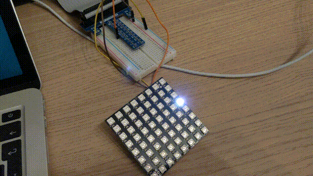

# WS2818 RGB LED SPI Driver

This crate is a driver for WS2818 RGB LED (chains). They are also known as "NeoPixel" devices. It's a simple, educational
example how to bring your LEDs to life. This [0] is an example device with chained WS2818 RGB LEDs that can be used with this driver.
This driver only works on Linux systems with a SPI device, like Raspberry Pi [1]. This is needed because my driver operates at
15.6MHz. This is required because I need to reach specific *timings in nanoseconds* according to the specification while sending data [2].
It uses a one wire protocol.

The SPI device in your Raspberry Pi has a reliable clock with high frequencies available. Regular GPIO pins 
**won't work!** Toggling GPIO pins takes 1µs (in my testing) which is *WAY TOO SLOW!* Therefore I use SPI.
There is a clock device in hardware - much more reliable!

Find the `MOSI`-Pin on your device (e.g. Raspberry Pi) and connect it with `DIN`-Port of the LED. That's all what's needed.

Have a look into the examples/code for further explications. :)

**There is no warranty that this will work on your setup! High frequency stuff is complicated!**

 

*Demo using a 8x8 RGB LED matrix. DIN is connected with MOSI (SPI Out Port).*

### Examples
See https://github.com/phip1611/ws2818-rgb-led-spi-driver/tree/master/examples. 

```
use std::io::Write;
use ws2818_rgb_led_spi_driver::encoding::{encode_rgb};

fn main() {
    println!("Make sure to have \"SPI\" on your Pi enabled and that MOSI-Pin is connected with DIN-Pin!");
    let mut spi = ws2818_rgb_led_spi_driver::setup_spi("/dev/spidev0.0").unwrap();

    let mut spi_bits = vec![];
    // set first three pixels to bright red, bright green and bright blue
    spi_bits.extend_from_slice(&encode_rgb(255, 0, 0));
    spi_bits.extend_from_slice(&encode_rgb(0, 255, 0));
    spi_bits.extend_from_slice(&encode_rgb(0, 0, 255));
    spi.write_all(&spi_bits).unwrap();
}
```

##### Links

[0] https://www.az-delivery.de/products/u-64-led-panel?variant=6127700738075 \
[1] https://www.raspberrypi.org/documentation/hardware/raspberrypi/spi/README.md \
[2] https://cdn-shop.adafruit.com/datasheets/WS2812.pdf 
